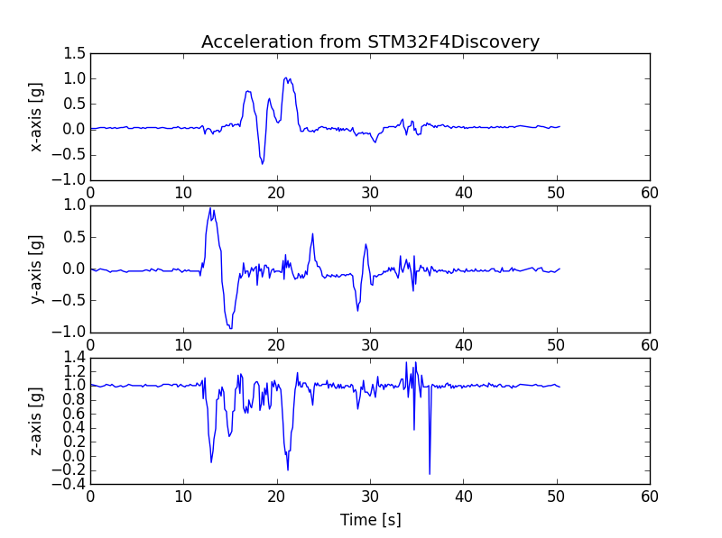

# ChibiOS-mems-usb project

In this repository you can find code for STM32F4 which communicates with onboard MEMS accelerometer LIS302DL (on Discovery board) and sends values over USB bulk endpoint.

The data is plotted on PC in real-time, as the data appears on the USB bus.

# ChibiOS
STM32 runs elegant and simple RTOS, ChibiOS/RT (http://www.chibios.org/dokuwiki/doku.php?id=chibios:book:start). ChibiOS project also provides HAL and drivers for all major hardware interfaces.

# Live Plot
In /pyusb directory a class for plotting the data gathered from USB is supplied. It depends on python3, pyUSB (https://github.com/walac/pyusb) and matplotlib (http://matplotlib.org).

# Debugging
USB bus activity was sniffed and debugged using USBlyzer 2.0. (http://www.usblyzer.com/)

# Data flow

MEMS accelerometer --(SPI)--> STM32 --(USB)--> PC --> matplotlib
